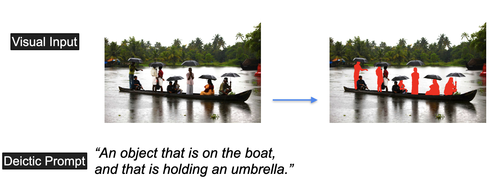

### *Refactoring is undegoing.
<!-- <p align="center">
  
</p>  -->

# DeiSAM: Segment Anything with Deictic Prompting
Hikaru Shindo, Manuel Brack, Gopika Sudhakaran, Devendra Singh Dhami, Patrick Schramowski, Kristian Kersting

[AI/ML Lab @ TU Darmstadt](https://ml-research.github.io/index.html)

<p align="left">
  
</p>
We propose DeiSAM, which integrates large pre-trained neural networks with differentiable logic reasoners. Given a complex, textual segmentation description, DeiSAM leverages Large Language Models (LLMs) to generate first-order logic rules and performs differentiable forward reasoning on generated scene graphs.
<!-- <p align="center">
  
</p>  -->


<!--  -->
<!--
**NEUMANN solves Behind-the-Scenes task.**
Reasoning behind the scenes:  The goal of this task is to compute the answer of a query, e.g., *``What is the color of the second left-most object after deleting a gray object?''* given a visual scene. To answer this query, the agent needs to reason behind the scenes and understand abstract operations on objects. In the first task, the agent needs to induce an explicit program given visual examples, where each example consists of several visual scenes that describe the input and the output of the operation to be learned. The abstract operations can be described and computed by first-order logic with functors.
In the second task, the agent needs to apply the learned programs to new situations to solve queries reasoning about non-observational scenes.

## How does it work?
NEUMANN compiles *first-order logic* programs into a *graph neural network*. Logical entailment is compted using probabilistic atoms and weighted rules using fuzzy logic operations.
 -->


# Install
[Dockerfile](.devcontainer/Dockerfile) is avaialbe in the [.devcontainer](.devcontainer) folder.

To install further dependencies, clone [Grounded-Segment-Anything](https://github.com/IDEA-Research/Grounded-Segment-Anything) and then:
<!-- and [GroundingDINO](https://github.com/IDEA-Research/GroundingDINO) repositories, and then-->
<!-- in the [Grounded-Segment-Anything](./Grounded-Segment-Anything) folder,  -->
```
cd neumann/
pip install -e .
cd ../Grounded-Segment-Anything/
cd segment_anything
pip install -e .
cd ../GroundingDINO
pip install -e .
```

If an error appears regarding OpenCV (circular import), try:
```
pip uninstall opencv-python
pip uninstall opencv-contrib-python
pip uninstall opencv-contrib-python-headless
pip3 install opencv-contrib-python==4.5.5.62
```

Download vit model
```
wget https://huggingface.co/spaces/abhishek/StableSAM/resolve/main/sam_vit_h_4b8939.pth
```

# Experiments
**DeiVG datasets can be downloaded here
[link](https://osf.io/v32aq/?view_only=064a96bf0c8a4ee6bd6127544ddc27af).** Please locate downloaded files to `data/`.

Please download the latest Visual Genome here [link](https://homes.cs.washington.edu/~ranjay/visualgenome/api.html), and locate downloaded files to `data/visual_genome/`.

To solve DeiVG using DeiSAM:
```
python src/solve_deivg.py --api-key YOUR_OPENAI_API_KEY -c 1
python src/solve_deivg.py --api-key YOUR_OPENAI_API_KEY -c 2
python src/solve_deivg.py --api-key YOUR_OPENAI_API_KEY -c 3
```

To perform learning on DeiSAM:
```
python src/learn_deisam.py --api-key YOUR_OPENAI_API_KEY -c 1 -sm VETO -su
python src/learn_deisam.py --api-key YOUR_OPENAI_API_KEY -c 2 -sm VETO -su
```


<!--
# Experiments

## Prerequisites
Docker container is available in folder [.devcontainer](./.devcontainer/Dockerfile),
which is compatible with [packages](./pip_requirements.txt) (produced by pip freeze).
The main dependent packages are:
```
pytorch
torch-geometric
networkx
```
We used Python 3.8 for the experiments.
See [Dockerfile](.devcontainer/Dockerfile) for more details.

## Build a Docker container
Simply use VSCode to open the container, or build the container manually:
To run on machines without GPUs
```
cp .devcontainer/Dockerfile_nogpu ./Dockerfile
docker build -t neumann .
docker run -it -v <local path to the repository>:/neumann --name neumann neumann
```
For example, the local path could be: `/Users/username/Workspace/github/neumann`. The path is where this repository has been cloned.

For the GPU-equipped machines, use:
```
cp .devcontainer/Dockerfile ./Dockerfile
docker build -t neumann .
docker run -it -v <local path to the repository>:/neumann --name neumann neumann
```
To open the container on machines without GPUs using VSCode, run
```
cp .devcontainer/Dockerfile_nogpu .devcontainer/Dockerfile
```
and use the VSCode remotehost extension (recommended). -->


<!--
## Perform learning
For example, in the container, learning Kandinsky patterns on red triangle using the demo dataset can be performed:
```
cd /neumann
python3 src/train_neumann.py --dataset-type kandinsky --dataset red-triangle --num-objects 6 --batch-size 12 --no-cuda --epochs 30 --infer-step 4 --trial 5 --n-sample 10 --program-size 1  --max-var 6 --min-body-len 6 --pos-ratio 1.0 --neg-ratio 1.0
```
An exenplary log can be found [redtrianlge_log.txt](./logs/redtriangle_log.txt).

More scripts are available:

[Learning kandinsky/clevr-hans patterns](./scripts/solve_kandinsky_clevr.sh)

[Solving Behind-the-Scenes](./scripts/solve_behind-the-scenes.sh) -->

# LICENSE
See [LICENSE](./LICENSE).

